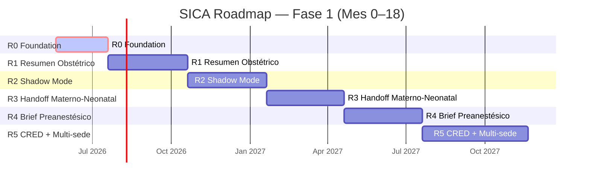

# SICA — Master Plan

## Estado general

Última actualización: `2026-05-22T01:21:19Z`  
Generado automáticamente por `.github/workflows/sync-roadmap.yml`

**Release activo:** R0 Foundation (Mes 0-2)  
**Hash del último commit:** `842dc62`

## Progreso general

```
█████████████░░░░░░░░░░░░░░░░░░░░░░░░░░░ 5/15 issues cerrados (33%)
```

✅ Cerrados: 5 | 🔄 En progreso: 0 | ⬜ Pendientes: 10 | 🚨 Bloqueantes: 4

---

## Timeline visual



**Estado por release:**

| Release | Período | Estado | Progreso |
|---------|---------|--------|----------|
| R0 Foundation | May–Jul 2026 | 🔄 Activo | ██████░░░░ 62% |
| R1 Resumen Obstétrico | Jul–Oct 2026 | ⬜ Pendiente | ░░░░░░░░░░ 0% |
| R2 Shadow Mode | Oct 2026–Ene 2027 | ⬜ Pendiente | ░░░░░░░░░░ 0% |
| R3 Handoff Materno-Neonatal | Ene–Abr 2027 | ⬜ Pendiente | ░░░░░░░░░░ 0% |
| R4 Brief Preanestésico | Abr–Jul 2027 | ⬜ Pendiente | ░░░░░░░░░░ 0% |
| R5 CRED + Multi-sede | Jul–Nov 2027 | ⬜ Pendiente | ░░░░░░░░░░ 0% |

---

## Progreso por Release

### R0 Foundation (activo)

**Período:** Mes 0-2  
**Due date:** 2026-07-20  
**Wedge:** Benchmark + stack mínimo, sin UI clínica  
**Gate de salida:** MedGemma 4B ≥85% factualidad, ≤5% omisiones críticas

```
█████████████████████████░░░░░░░░░░░░░░░ 5/8 issues cerrados (62%)
```

| # | Issue | Labels | Estado | Cerrado |
|---|-------|--------|--------|---------|
| #8 | [[R0] Setup técnico del monorepo](https://github.com/aaronhuaynate66/sica-platform/issues/8) | fase-1, r0 | ✅ Cerrado | 2026-05-21 |
| #9 | [[R0] Validar pipeline clinical-extractor en synthetic_case_01](https://github.com/aaronhuaynate66/sica-platform/issues/9) | fase-1, r0 | ⬜ Abierto | — |
| #10 | [[R0] Diseñar el harness de evaluación: dataset retrospectivo + ground truth process](https://github.com/aaronhuaynate66/sica-platform/issues/10) | fase-1, r0 | ✅ Cerrado | 2026-05-22 |
| #11 | [[R0] Definir métricas de factualidad: span-level accuracy + critical omissions](https://github.com/aaronhuaynate66/sica-platform/issues/11) | fase-1, r0 | ✅ Cerrado | 2026-05-22 |
| #12 | [[R0] Investigar viabilidad de MedGemma 4B local en el entorno del partner](https://github.com/aaronhuaynate66/sica-platform/issues/12) | fase-1, r0 | ⬜ Abierto | — |
| #13 | [[R0] Crear primer ADR sobre política de routing de modelos (MedGemma vs Gemini vs Claude)](https://github.com/aaronhuaynate66/sica-platform/issues/13) | fase-1, r0 | ✅ Cerrado | 2026-05-21 |
| #14 | [[R0] Setup de Langfuse self-hosted o decisión de servicio gestionado](https://github.com/aaronhuaynate66/sica-platform/issues/14) | fase-1, r0 | ⬜ Abierto | — |
| #15 | [[R0] Documentar políticas de seguridad y manejo de PHI antes del primer dato real](https://github.com/aaronhuaynate66/sica-platform/issues/15) | fase-1, r0 | ✅ Cerrado | 2026-05-21 |

### R1 Resumen Obstétrico

**Período:** Mes 2-5  
**Due date:** 2026-10-20  
**Wedge:** Panel standalone, sesiones de revisión  
**Gate de salida:** >70% resúmenes calificados útiles sin edición mayor

_(Sin issues asignados. Arranca cuando el release previo cierre gate.)_

### R2 Shadow Mode

**Período:** Mes 5-8  
**Due date:** 2027-01-20  
**Wedge:** Embed en HIS, sin uso mandatorio  
**Gate de salida:** ≥40% uso + recall brechas ≥80% + 0 incidentes seguridad

_(Sin issues asignados. Arranca cuando el release previo cierre gate.)_

### R3 Handoff Materno-Neonatal

**Período:** Mes 8-11  
**Due date:** 2027-04-20  
**Wedge:** Primer flujo crítico (asistivo)  
**Gate de salida:** Completitud ≥95% + correcciones <10% + aprobación neonatología

_(Sin issues asignados. Arranca cuando el release previo cierre gate.)_

### R4 Brief Preanestésico

**Período:** Mes 11-14  
**Due date:** 2027-07-20  
**Wedge:** Cesárea programada y urgencia  
**Gate de salida:** <10% correcciones críticas + aprobación calidad

_(Sin issues asignados. Arranca cuando el release previo cierre gate.)_

### R5 CRED + Multi-sede

**Período:** Mes 14-18  
**Due date:** 2027-11-20  
**Wedge:** Pediatría longitudinal + producto replicable  
**Gate de salida:** Sede 2 onboarded + renovación partner

_(Sin issues asignados. Arranca cuando el release previo cierre gate.)_

---

## Bloqueantes externos (cruzan releases)

Estos issues no pertenecen a un release específico. Bloquean avance de Fase 1 o requieren acciones en el mundo real.

| # | Issue | Labels | Estado |
|---|-------|--------|--------|
| #1 | [[REGULATORIO] Validar clasificación de SICA como software asistivo no dispositivo médico](https://github.com/aaronhuaynate66/sica-platform/issues/1) | bloqueante, fase-1, regulatorio | ⬜ Abierto |
| #2 | [[LEGAL] Validar plan de protección de datos (Ley 29733): banco, DPIA, DPO, consentimientos](https://github.com/aaronhuaynate66/sica-platform/issues/2) | bloqueante, fase-1, legal | ⬜ Abierto |
| #3 | [[MARCA] Verificar marca SICA en Indecopi](https://github.com/aaronhuaynate66/sica-platform/issues/3) | fase-1, legal, marca | ⬜ Abierto |
| #4 | [[GTM] Confirmar partner fundador (clínica privada materno-infantil en Lima)](https://github.com/aaronhuaynate66/sica-platform/issues/4) | bloqueante, fase-1, gtm | ⬜ Abierto |
| #5 | [[DATA] Acceso a 150-200 historias obstétricas desidentificadas para benchmark R0](https://github.com/aaronhuaynate66/sica-platform/issues/5) | bloqueante, data, fase-1, r0 | ⬜ Abierto |
| #6 | [[MERCADO] Análisis competitivo Perú/LatAm con field research](https://github.com/aaronhuaynate66/sica-platform/issues/6) | fase-1, investigacion, mercado | ⬜ Abierto |
| #7 | [[GTM] Identificar 5 KOLs target para Distribution Engine](https://github.com/aaronhuaynate66/sica-platform/issues/7) | distribution-engine, fase-1, gtm | ⬜ Abierto |

---

## Issues por categoría

### Regulatorio y Legal

- ⬜ [#1](https://github.com/aaronhuaynate66/sica-platform/issues/1) [REGULATORIO] Validar clasificación de SICA como software asistivo no dispositivo médico
- ⬜ [#2](https://github.com/aaronhuaynate66/sica-platform/issues/2) [LEGAL] Validar plan de protección de datos (Ley 29733): banco, DPIA, DPO, consentimientos
- ⬜ [#3](https://github.com/aaronhuaynate66/sica-platform/issues/3) [MARCA] Verificar marca SICA en Indecopi

### GTM y Distribution

- ⬜ [#4](https://github.com/aaronhuaynate66/sica-platform/issues/4) [GTM] Confirmar partner fundador (clínica privada materno-infantil en Lima)
- ⬜ [#7](https://github.com/aaronhuaynate66/sica-platform/issues/7) [GTM] Identificar 5 KOLs target para Distribution Engine

### Mercado

- ⬜ [#6](https://github.com/aaronhuaynate66/sica-platform/issues/6) [MERCADO] Análisis competitivo Perú/LatAm con field research

### Datos y Eval

- ⬜ [#5](https://github.com/aaronhuaynate66/sica-platform/issues/5) [DATA] Acceso a 150-200 historias obstétricas desidentificadas para benchmark R0
- ✅ [#10](https://github.com/aaronhuaynate66/sica-platform/issues/10) [R0] Diseñar el harness de evaluación: dataset retrospectivo + ground truth process
- ✅ [#11](https://github.com/aaronhuaynate66/sica-platform/issues/11) [R0] Definir métricas de factualidad: span-level accuracy + critical omissions

### Modelos AI

- ⬜ [#12](https://github.com/aaronhuaynate66/sica-platform/issues/12) [R0] Investigar viabilidad de MedGemma 4B local en el entorno del partner
- ✅ [#13](https://github.com/aaronhuaynate66/sica-platform/issues/13) [R0] Crear primer ADR sobre política de routing de modelos (MedGemma vs Gemini vs Claude)

### Seguridad

- ✅ [#15](https://github.com/aaronhuaynate66/sica-platform/issues/15) [R0] Documentar políticas de seguridad y manejo de PHI antes del primer dato real

### Infraestructura

- ✅ [#8](https://github.com/aaronhuaynate66/sica-platform/issues/8) [R0] Setup técnico del monorepo
- ⬜ [#9](https://github.com/aaronhuaynate66/sica-platform/issues/9) [R0] Validar pipeline clinical-extractor en synthetic_case_01
- ⬜ [#14](https://github.com/aaronhuaynate66/sica-platform/issues/14) [R0] Setup de Langfuse self-hosted o decisión de servicio gestionado

---

## Decisiones arquitectónicas (ADRs)

| # | Decisión | Estado | Fecha |
|---|----------|--------|-------|
| 0001 | [Monorepo en `sica-platform` con Turborepo + pnpm](docs/decisions/0001-monorepo-turborepo.md) | Accepted | 2026-05-20 |
| 0002 | [Living Roadmap System: `MASTER_PLAN.md` auto-sincronizado desde issues](docs/decisions/0002-living-roadmap-system.md) | Accepted | 2026-05-21 |
| 0003 | [Security and PHI handling policy](docs/decisions/0003-security-and-phi-policy.md) | Accepted | 2026-05-21 |
| 0004 | [Política de routing de modelos AI](docs/decisions/0004-model-routing-policy.md) | Accepted | 2026-05-21 |
| 0005 | [Decisiones metodológicas de evaluación clínica](docs/decisions/0005-evaluation-methodology.md) | Accepted | 2026-05-22 |

Auto-generado leyendo `docs/decisions/`.

---

## Commits recientes

Últimos 10 commits del repo (excluyendo bot):

| Hash | Autor | Mensaje | Fecha |
|------|-------|---------|-------|
| `842dc62` | aaronhuaynate66 | docs(evals): formalize factuality metrics specification (closes #11) | 2026-05-22 |
| `c5c5785` | aaronhuaynate66 | feat(evals): implement evaluation harness with metrics, comparators, reporters (closes #10) | 2026-05-22 |
| `69dd7fd` | aaronhuaynate66 | feat(plan): add Mermaid Gantt timeline and visual release progress to MASTER_PLAN | 2026-05-21 |
| `8898c61` | aaronhuaynate66 | docs(adr): add ADR 0004 model routing policy with conditional triggers (closes #13) | 2026-05-21 |
| `2eb7851` | aaronhuaynate66 | docs(security): add security policies, PHI handling, Ley 29733 compliance mapping (closes #15) | 2026-05-21 |
| `06215b2` | aaronhuaynate66 | feat(web): bootstrap Next.js app with 4 connected views (upload, timeline, dashboard, physician) | 2026-05-21 |
| `81f1100` | aaronhuaynate66 | fix(workflow): tolerar ausencia de ROADMAP.md en commit step | 2026-05-21 |
| `b56146e` | aaronhuaynate66 | feat(plan): replace ROADMAP.md with MASTER_PLAN.md, add milestones + per-release progress | 2026-05-21 |
| `442e0a8` | aaronhuaynate66 | feat(roadmap): add living roadmap system with auto-sync workflow | 2026-05-21 |
| `4d201d6` | aaronhuaynate66 | feat: monorepo skeleton + clinical-extractor service (R0 foundation) | 2026-05-21 |

---

## Infraestructura

| Item | Estado | Notas |
|------|--------|-------|
| GitHub repo público | ✅ Activo | https://github.com/aaronhuaynate66/sica-platform |
| GitHub Actions CI | ✅ Activo | ci.yml + sync-roadmap.yml |
| GitHub Project (kanban) | ✅ Activo | https://github.com/users/aaronhuaynate66/projects/2 |
| Milestones por release | ✅ Activo | R0-R5 con due dates y descripciones |
| Living Roadmap System | ✅ Activo | Auto-sync MASTER_PLAN.md en cada cambio de issue |
| Clinical Extractor (Python) | ✅ Local | Probado con synthetic_case_01.pdf |
| Baseline Fixture | ✅ | evals/fixtures/synthetic_case_01.expected.json |
| Sentry / Observabilidad | ⬜ Pendiente | R0 sprint |
| Supabase / Postgres | ⬜ Pendiente | R0 sprint |
| Vercel deploys | ⬜ Pendiente | R1 sprint |

---

## Cómo se mantiene este documento

Auto-generado por `scripts/generate_roadmap.py` ejecutado por `.github/workflows/sync-roadmap.yml`.

**Triggers de regeneración:**

- Apertura, cierre, edición de un issue
- Cambio de labels o milestone en un issue
- Merge de un PR a `main`
- Cron diario a las 13:00 UTC (safety net)
- Disparo manual (`workflow_dispatch`)

**No editar manualmente este archivo.** Cualquier cambio será sobrescrito en la próxima ejecución del workflow. Para cambiar el contenido visible, actualiza los issues, milestones, ADRs o commits — la fuente de verdad son ellos.

---

_Generado por SICA Living Roadmap System v0.2_
